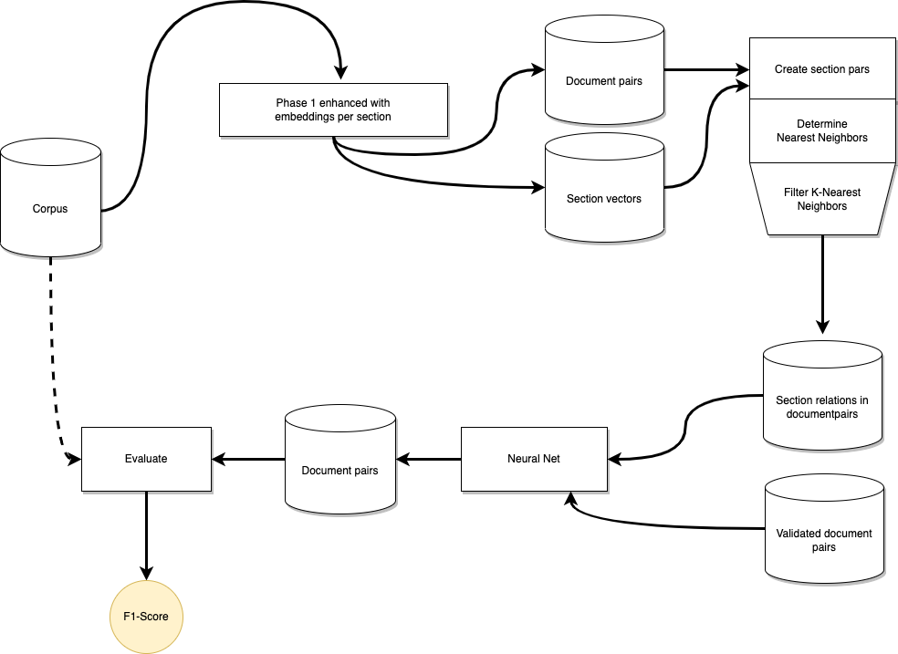
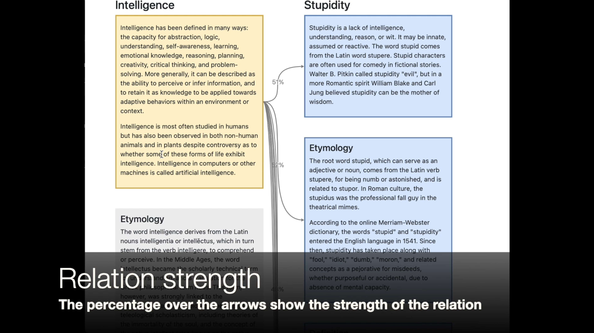

# SADDLE

This project contains the implementation of SADDLE, an algorithm for finding section similarities in
document pairs. These section similarities are used to improve finding new document pairs. 
It is based on the Large-scale Hierarchical Alignment (LHA) algorithm [Nikolov and Hahnloser, 2018]. 
As input, it uses Wikipedia articles in either English or Dutch. The algorithm can easily be altered to 
use other languages, too. The image below depicts the SADDLE architecture.



The algorithm consists of three phases. In phase one, the Wikipedia articles are read from a corpus 
file created by the Corpus tools. The documents are cleaned up after reading by removing 
Wikipedia markup and special characters. The last step of phase one creates an embedding of the document 
and the sections. This embedding is constructed by using one of the following algorithms:
- Word2Vec: [Mikolov et al., 2013]
- Sent2Vec: [Pagliardini et al., 2017]
- USE: [Cer et al., 2018]
- Sentence BERT: [Reimers and Gurevych, 2019]

The code can easily be extended to use other embedding methods. The embedding is used to find potential 
document pairs by using cosine similarity combined with a threshold.
The second phase uses the section embeddings of the document pairs to align sections. 
For testing purposes, an interactive HTML "application" can be created to visualize the 
section relations between documents dynamically.

[](images/demo.mp4 "Demo of functionality")


## Data
Two datasets were used to train SADDLE, [WiRe](https://github.com/mponza/WikipediaRelatedness/tree/clean/src/main/resources/datasets/wire.csv) and [WikiSim](https://github.com/mponza/WikipediaRelatedness/tree/clean/src/main/resources/datasets/wikisim.csv).
The datasets were converted to the common file format by the Corpus tools.

### WiRe
To validate their research, Ponza et al. [2017] created a dataset and made it publicly available for 
other researchers to validate their work. The dataset is called WiRe. The dataset contains 503 links from the 
English Wikipedia that have been assigned a score between 0 and 10. The construction of the dataset was done in 
three steps. First, the dataset of 100,000 entity pairs constructed from New York Times articles [DunietzandGillick, 2014]
was used as a base. Second, the resulting dataset was filtered and balanced by several algorithms. Last, 
two human evaluators assigned every article pair of the resulting dataset a score between 0 and 10. 
When their scores did not coincide, a third human evaluator discussed the score with the original evaluators. 
The process resulted in the WiRe dataset. A thorough process description can be found in Ponza et al. [2017]

### WikiSim
Another dataset that \citet{Ponza2017} has used for validation is the WikiSim dataset. 
It was created to validate the semantic relatedness obtained from Wikipedia links as described in 
[Witten and Milne, 2008], based on the WordSim 353 dataset ((Finkelstein et al. [2002])), humans annotated it. 
The document pairs have been rated with a value between 0 and 1. Unfortunately, the details of the annotation 
process are not described in the paper.

### GWikiMatch
GWikiMatch is a benchmark dataset for long-form document matching in the form of a TSV file where each record contains a 
source and destination URL from the English Wikipedia along with a similarly-label (0=not similar, 1=somewhat similar, and 2=strongly similar. The Wikipedia URL is translated to a WikiData ID, so it can easily be used in combination with data obtained from Wikidata.

## Details
The sections below give a short description of the usage and details of each tool. 

#### createvectors.py
This script creates an embedding vector for every document in the corpus. 
Next to a document embedding, a section embedding
is also created separately. The embedding method can be specified. 
The vectors are written to an XML file.

```
usage: createvectors.py [-h] -c CORPUSDIRECTORY [-a {word2vec,sent2vec,sbert,use}] -o OUTPUT

# Script to create embeddings from a document and section, similar to the LHA algorithm (Nikola I. Nikolov and Richard H.R. Hahnloser)

options:
  -h, --help            show this help message and exit
  -c CORPUSDIRECTORY, --corpusdirectory CORPUSDIRECTORY
                        The corpus directory in the Common File Format
  -a {word2vec,sent2vec,sbert,use}, --algorithm {word2vec,sent2vec,sbert,use}
                        The embedding algorithm (default "sent2vec")
  -o OUTPUT, --output OUTPUT
                        Output file for the XML file with the documentvectors
```

#### createrelations.py
The vectors created in by `createvectors.py` are matched based on cosine similarity. The similarity is the threshold
for selecting a document relation. The output can be further limited by specifying a maximum number of relations to 
generate.

```
usage: createrelations.py [-h] -c CORPUSDIRECTORY -i DOCUMENTVECTORFILE -s SIMILARITY -m MAXREL -o OUTPUT 
                          [-p CORPUS_PAIRS] [-r HTML]

Create document relations based on the document vectors that were created with "createvectors.py"

options:
  -h, --help            show this help message and exit
  -c CORPUSDIRECTORY, --corpusdirectory CORPUSDIRECTORY
                        The corpus directory in the Common File Format
  -i DOCUMENTVECTORFILE, --documentvectorfile DOCUMENTVECTORFILE
                        The XML file containing the documentvectors
  -s SIMILARITY, --similarity SIMILARITY
                        Minimum similarity between the files (actual similarity times 100)
  -m MAXREL, --maxrel MAXREL
                        Maximum number of relations per document (default: 20)
  -o OUTPUT, --output OUTPUT
                        Output file for the XML file with the document relations
  -p CORPUS_PAIRS, --corpus_pairs CORPUS_PAIRS
                        Create relations from the pairs in the corpus only
  -r HTML, --html HTML  Output file for readable HTML output
```

### LHA_Phase2.py
This tool calculates the similarity of documents based on section embeddings. It does this to limit the number
of relations to be trained on. The selection of these relations is used as input for `trainModel.py`.

```
usage: LHA_Phase2.py [-h] -c CORPUSDIRECTORY -i DOCUMENTVECTORFILE -r RELATIONSFILES -s SIMILARITY 
                             [-k NEARESTNEIGHBORS] -o OUTPUT [-d HTML]

Creates relations between the sections in documents using the files created with "createvectors.py" and "createrelations.py"

options:
  -h, --help            show this help message and exit
  -c CORPUSDIRECTORY, --corpusdirectory CORPUSDIRECTORY
                        The corpus directory in the Common File Format
  -i DOCUMENTVECTORFILE, --documentvectorfile DOCUMENTVECTORFILE
                        The XML file containing the documentvectors
  -r RELATIONSFILES, --relationsfiles RELATIONSFILES
                        The XML file containing the relations between the documents
  -s SIMILARITY, --similarity SIMILARITY
                        Minimum similarity used to select the sections (actual similarity times 100)
  -k NEARESTNEIGHBORS, --nearestneighbors NEARESTNEIGHBORS
                        The maximum number of nearest neighbours to find (K)
  -o OUTPUT, --output OUTPUT
                        Output file for the XML file with the section relations
  -d HTML, --html HTML  Output directory for readable HTML output (debug)
```
### trainModel.py
This script trains a model based on the output generated by `LHA_Phase2.py` and writes the training results to a
directory.

```
usage: trainModel.py [-h] -N SECTIONS -c CORPUS_DIR -nn {plain,masked,lstm,stat,test} 
                     -s CACHE_DIR [-v VECTORS_DIR] [-r RELATIONSFILE] -m HEATMAP_DIR 
                     -t {truncate,avg} -o RESULTS_DIR [-mo MODELS_DIR]

Train the optimal model. 

options:
  -h, --help            show this help message and exit
  -N SECTIONS, --sections SECTIONS
                        The number of sections to consider
  -c CORPUS_DIR, --corpus_dir CORPUS_DIR
                        The directory of the corpus to train on
  -nn {plain,masked,stat,test}, --neuralnetworktype {plain,masked,stat,test}
                        The type of neural network
  -s CACHE_DIR, --cache_dir CACHE_DIR
                        The directory used for caching
  -v VECTORS_DIR, --vectors_dir VECTORS_DIR
                        The directory containing the document and section vectors 
                        of this corpus
  -r RELATIONSFILE, --relationsfile RELATIONSFILE
                        The XML file containing the relations between the documents
  -m HEATMAP_DIR, --heatmap_dir HEATMAP_DIR
                        The directory containing the images with the heatmaps
  -t {truncate,avg}, --transformation {truncate,avg}
                        The transformation to apply to sections with an index larger than N
  -o RESULTS_DIR, --results_dir RESULTS_DIR
                        The director containing the results
  -mo MODELS_DIR, --models_dir MODELS_DIR
                        The directory containing the models, optional

```

### results.py
The results assembled by `trainModel.py` can be exported with this script for further analysis. This export can be 
to a file or an SQL database.

```
usage: results.py [-h] -d RESULTS_DIR -t {excel,tsv,sql} -o OUTPUT_FILE

Combine the results from trianModel.py

options:
  -h, --help            show this help message and exit
  -d RESULTS_DIR, --results_dir RESULTS_DIR
                        Directory containing the resultsfile
  -t {excel,tsv,sql}, --type {excel,tsv,sql}
                        The output type can be "excel", "sql" or "tsv"
  -o OUTPUT_FILE, --output_file OUTPUT_FILE
                        The output file, in the case of sql, the connectionstring
```

### scripts/process_file.sh
The Python scripts are glued together by using this ZSH script. It calls all scripts with the right parameters.

```
usage: process_file -c <corpus> -m <encoding method> [-s <Sim>] [-d <MaxDoc>] 
                    [-n NearestNeighbours] [-t <NrOfSecions>] [-r <NN_type>]

Processes a single file 
```